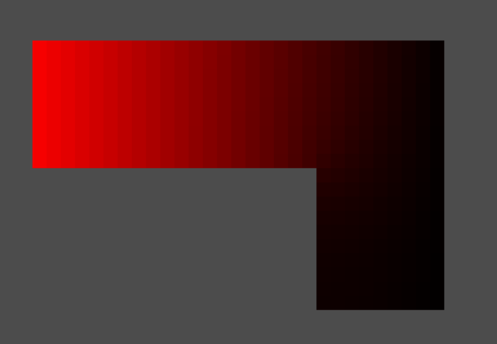

# Fluid-Velocity-Solver-Demo
This demo tries to show flow that satisfy equtaion "amount of incoming matter is amount of out going matter". It is based on Godot game engine to show this behavior.

In order to satisfy equation flow has given pressure that can be computed.

